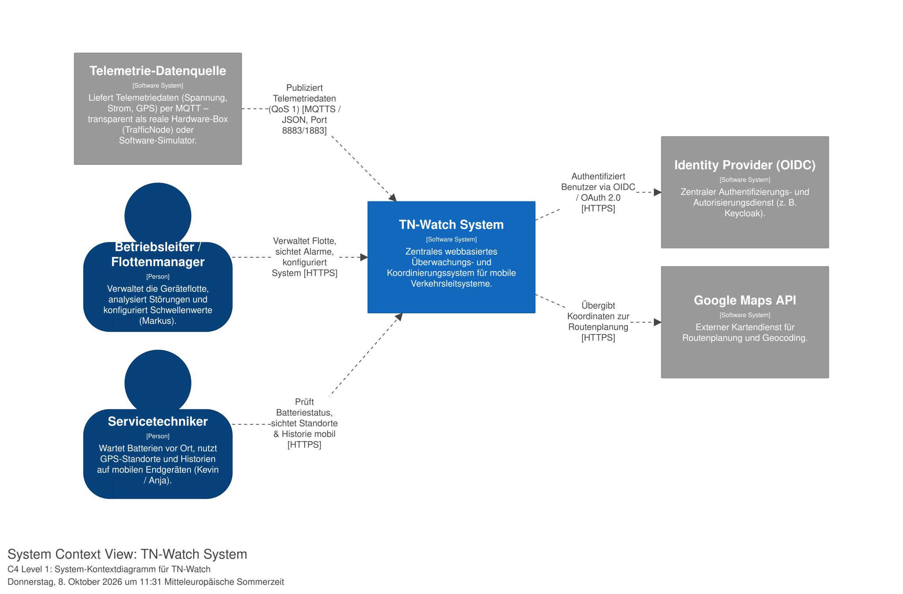
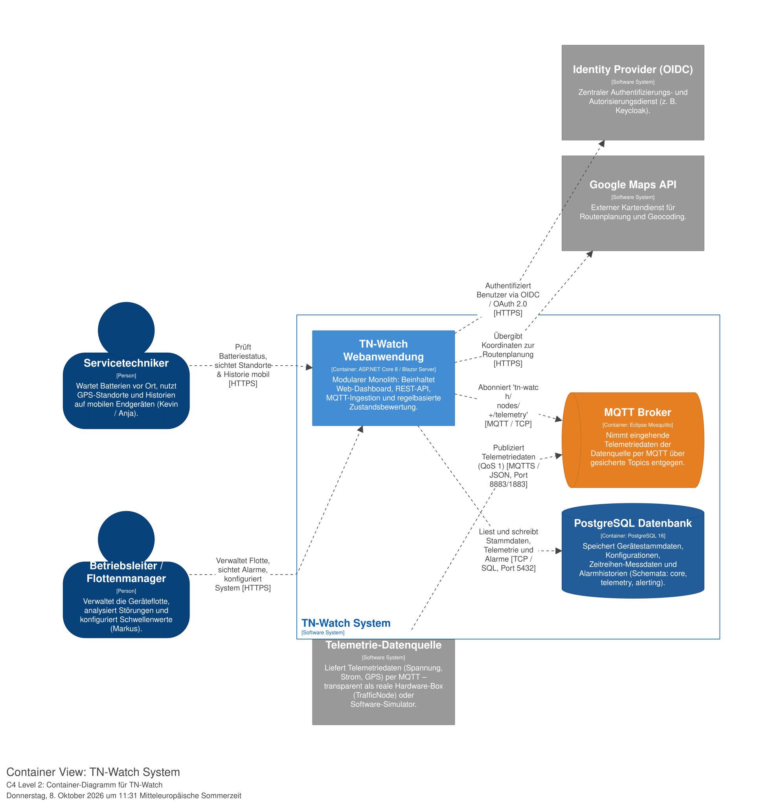
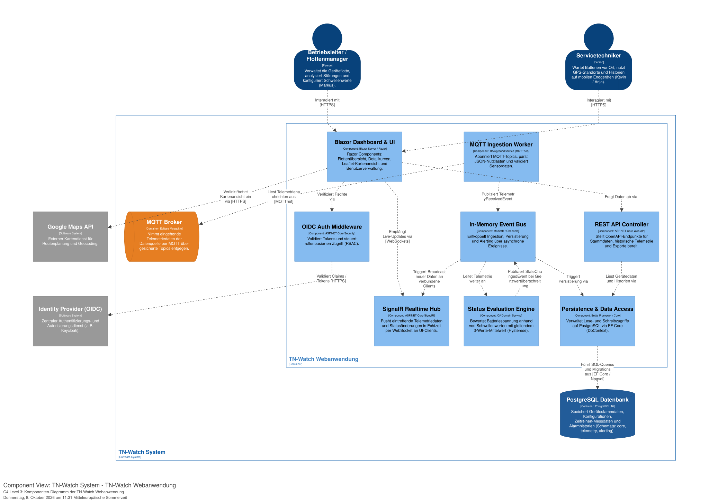
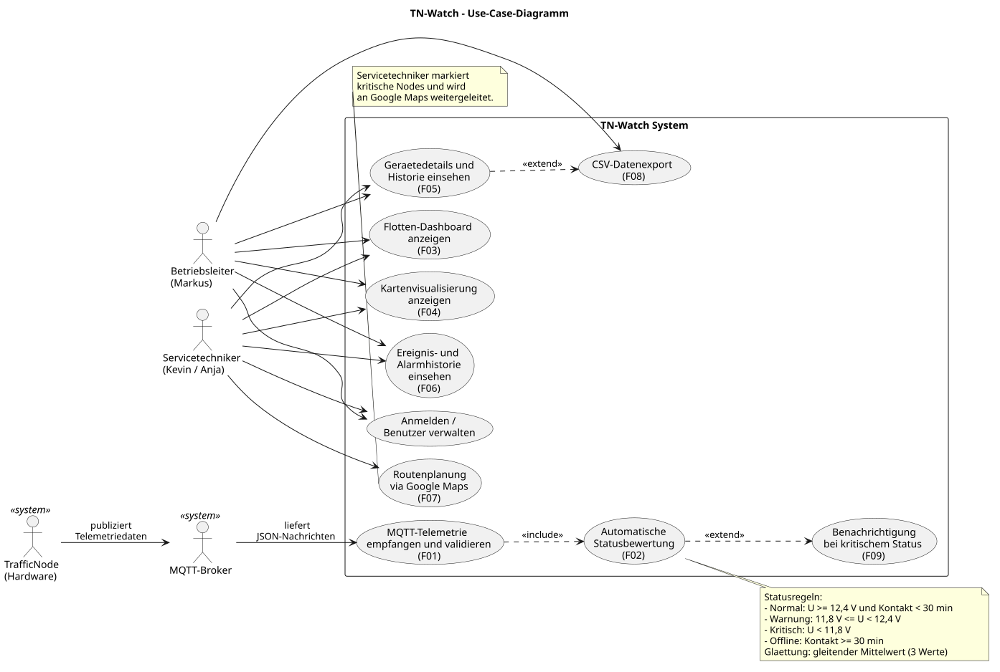
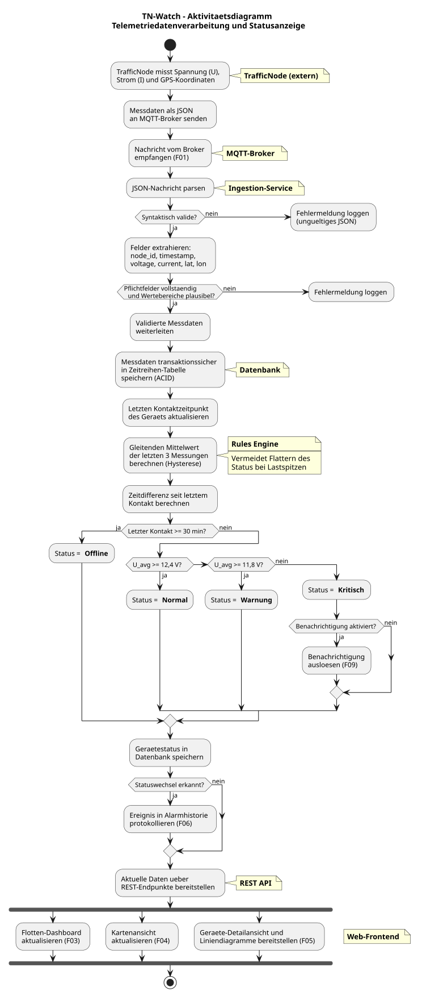

# Doku-dokumentation

## 📁 Strukturübersicht

```
docs/
├── README.md                  
├── adr/                       # Architecture Decision Records
│   └── ADR.md                 
├── architecture/              # C4-Architekturmodel
│   ├── workspace.dsl          
│   └── c4/                    
│       ├── SystemContext.svg 
│       ├── Containers.svg     
│       └── Components.svg     
└── uml/                       # Analyse- & Verhaltensdiagramme (PlantUML)
    ├── use_case_diagram.puml  
    ├── use_case_diagram.svg   
    ├── activity_diagram.puml  
    └── activity_diagram.svg
```

## 🏛️ 1. Architektur & C4-Modell (`architecture/`)

Das System ist nach dem **C4-Modell** strukturiert und mit **[Structurizr](https://structurizr.com/)** modelliert.

* **DSL-Spezifikation:** [`architecture/workspace.dsl`](architecture/workspace.dsl)

### C4 Level 1: System Context
Überblick über Benutzergruppen, das TN-Watch System und externe Schnittstellen (Datenquelle, Identity Provider, Google Maps).


### C4 Level 2: Container
Verteilung auf die Container (Eclipse Mosquitto MQTT Broker, PostgreSQL Datenbank und Modularer ASP.NET Core Monolith).


### C4 Level 3: Komponenten
Aufbau der Webanwendung (Blazor UI, SignalR Realtime Hub, MQTT Ingestion Worker, Event Bus, Status Evaluation Engine, EF Core).


---

## 📝 2. Architekturentscheidungen (`adr/`)

Die nachvollziehbare Dokumentation aller grundlegenden Architekturentscheidungen nach dem MADR-Schema:

* **[Architecture Decision Records (ADR)](adr/ADR.md)**
  * **ADR-01:** Architektur-Stil: Modularer Monolith
  * **ADR-02:** Schnittstellen: REST & SignalR (Hybrid)
  * **ADR-03:** Persistenz: PostgreSQL & EF Core
  * **ADR-04:** Telemetrie: MQTT (Eclipse Mosquitto & MQTTnet)
  * **ADR-05:** Frontend: ASP.NET Core Blazor (Server / Razor Components)
  * **ADR-06:** Authentifizierung: OpenID Connect (OIDC) mit RBAC
  * **ADR-07:** Datenverarbeitung: Event-Driven (In-Memory via MediatR / Channels)
  * **ADR-08:** Deployment: Containerisiert via Docker Compose (On-Premises / Lokal)
  * **ADR-09:** DB-Strategie: Gemeinsame PostgreSQL-Datenbank mit getrennten Schemas

---

## 📊 3. UML-Diagramme (`uml/`)

Die Verhaltens- und Anwendungsfalldiagramme werden mit **PlantUML** gepflegt und über die GitHub Action [`.github/workflows/plantUML.yml`](../.github/workflows/plantUML.yml) bei jedem Push automatisch als `.svg` gerendert:

* **[Use-Case-Diagramm](uml/use_case_diagram.puml)**:  
  
* **[Aktivitätsdiagramm](uml/activity_diagram.puml)**:  
  
